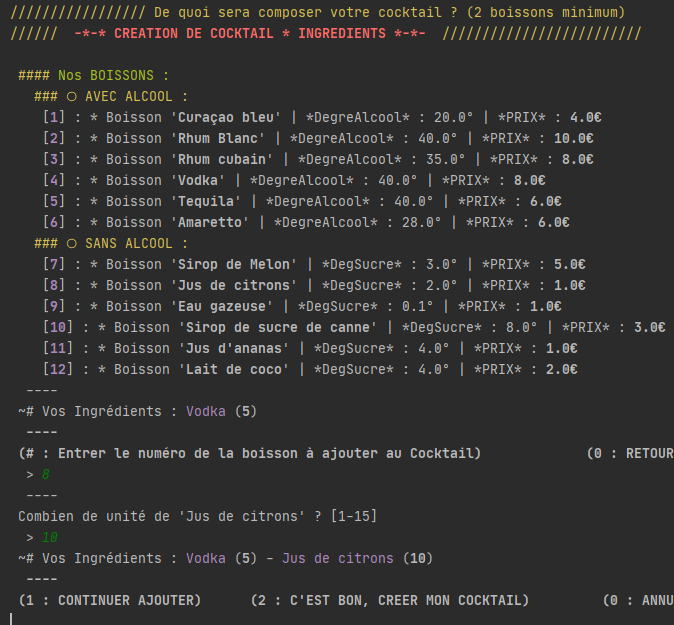
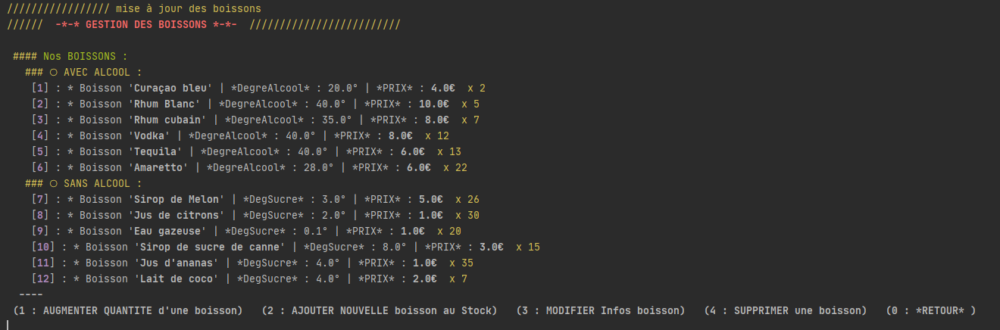

# Bar à Cocktail - JAVA #Equipe1GMI2

L'objectif de ce projet était de créer un logiciel pour gérer un bar à cocktail. 

### ⚙ HOW TO RUN IT
Run 'Main.java'  

### 🍹 BIENVENUE DANS LE BAR 

Une fois le programme exécuté nous arrivons sur la page d’accueil de notre programme.  Nous avons trois possibilités:
- (1) pour continuer en tant que client
- (2) pour continuer en tant que barman
- (0) pour quitter le programme
- 
Tout au long de nôtre programme, il suffit de d’écrire le chiffre qui correspond puis d’appuyer sur la touche “entrée”.

#### ☺ Client
Le client arrive directement sur une page affichant les différents cocktails et boissons.
Il a de nouveau trois possibilités:  <b>commander un cocktail ou une boisson</b>, <b>créer son propre cocktail</b> avec les différentes boissons et ingrédients mis à disposition, quitter le bar et revenir à la page d’accueil. 

#### 📋 Commande
Pour commander une boisson ou un cocktail, il suffit d’écrire le chiffre correspondant à la boisson au cocktail voulu puis nous avons la possibilité de choisir la quantité. La quantité choisie doit être strictement inférieure au stock restant du bar ou il sera demandé au client de redonner une nouvelle quantité. Le client aura alors la possibilité de recommander une nouvelle boisson ou cocktail ou alors de finir la commande.
Toutes les commandes sont enregistrées dans un dossier “commandes_backups” où les commandes sont enregistrées dans des fichiers Json.
Si le client choisit de finir la commande il a quatre possibilités: continuer la commande, procéder au paiement, modifier la commande et annuler la commande.

#### 🍸 Créer son cocktail

Pour la création de cocktail le client a la liste de toutes boissons du bar. Il doit choisir au minimum 2 boissons. Une fois toutes les boissons choisies pour notre cocktail, le client a la possibilité de nommer son cocktail. Une fois la création terminée, il peut alors commander son cocktail qui s'affiche avec les autres cocktails du bar déjà présents.
 
#### ⚙ Gestion du bar

Pour la gestion du bar, le barman a trois possibilités:  gestion des boissons, gestions de cocktails et retour.

##### • Gestions des Boisson
Le barman à la possibilité de rajouter du stocks aux boissons, ajouter une nouvelle boissons sur la carte du bar ou même de supprimer un boisson de la carte.
Nos boissons sont définis avec plusieurs critères: un nom, un degré de sucre si il s’agit d’une boisson non alcoolisée ou du degré d’alcool dans le cas contraire, une couleur qui nous sera utile dans la suite du projet avec l’interface graphique, une quantité qui correspond au nombre de canettes de 200ml de cette boisson ainsi que le prix d’une canette. Toutes les boissons de la carte sont stockées dans un fichier json.

##### • Gestions des Cocktails

Pour la gestion des cocktails, le barman a la possibilité de soit créer un cocktail, soit supprimer un cocktail de la carte. Les cocktails sont composés d’au minimum 2 boissons. Ils se caractérisent par un nom, …., des ingrédients et d’une couleur qui nous servira dans la suite du projet avec l’interface graphique.

---
### 📸 Screenshots 

---
### 👨🏾‍💻👨🏼‍💻 Auteurs
[Mlamali SAID SALIMO](https://www.linkedin.com/in/mlamalisaidsalimo) - [Ari RAJAOFERA](https://www.linkedin.com/in/mlamalisaidsalimo) https://www.linkedin.com/in/ari-rajaofera/
[Guillaume URVOY](https://www.linkedin.com/in/urvoy-guillaume-7849aa1b6/) - 
